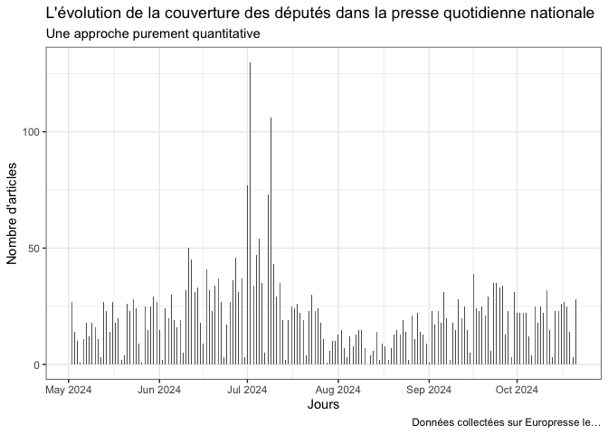
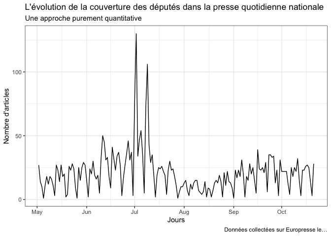
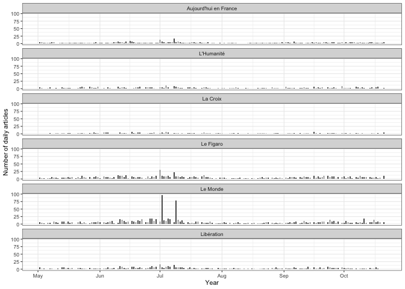
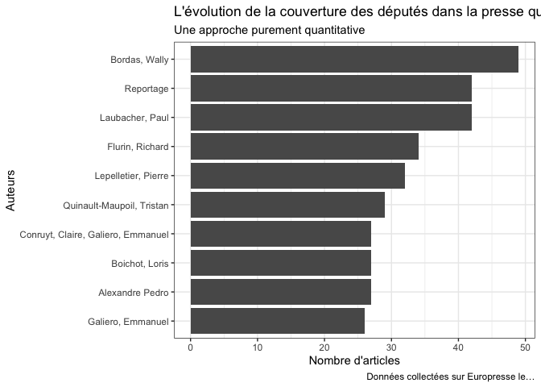
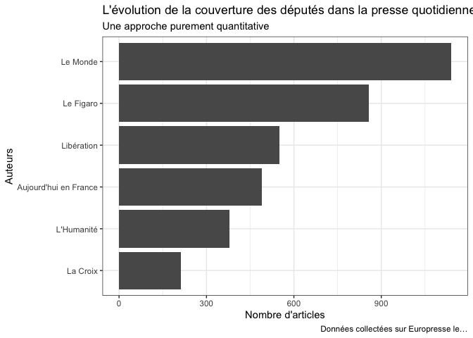

Europresse_to_Dataframe
================
Gilles Bastin
2024-10-21

- [1. Objectif et prérequis](#1-objectif-et-prérequis)
  - [1.1. Objectif](#11-objectif)
  - [1.2. Prérequis](#12-prérequis)
- [2. Accéder à Europresse et rechercher des articles “à la
  main”](#2-accéder-à-europresse-et-rechercher-des-articles-à-la-main)
- [3. Collecter les articles au format
  HTML](#3-collecter-les-articles-au-format-html)
- [4. Convertir les données HTML en
  dataframe](#4-convertir-les-données-html-en-dataframe)
  - [4.1. Environnement de travail](#41-environnement-de-travail)
  - [4.2. Ecriture d’une fonction pour lire (“parser”) le code
    HTML](#42-ecriture-dune-fonction-pour-lire-parser-le-code-html)
- [5. Nettoyage des données](#5-nettoyage-des-données)
  - [5.1. Supprimer les doublons
    d’articles](#51-supprimer-les-doublons-darticles)
  - [5.2. Nettoyage du Titre de la
    source](#52-nettoyage-du-titre-de-la-source)
  - [5.3. Nettoyage de la variable
    Texte](#53-nettoyage-de-la-variable-texte)
  - [5.4. Création d’un identifiant unique pour chaque
    article](#54-création-dun-identifiant-unique-pour-chaque-article)
  - [5.6. Longueur des articles
    (optionnel)](#56-longueur-des-articles-optionnel)
  - [5.7. Variables de date
    (optionnel)](#57-variables-de-date-optionnel)
  - [5.8. Suppression d’articles
    marginaux](#58-suppression-darticles-marginaux)
- [6. Exploration élémentaire du
  corpus](#6-exploration-élémentaire-du-corpus)
  - [6.1. Distribution du corpus dans le
    temps](#61-distribution-du-corpus-dans-le-temps)
  - [6.2. Auteurs fréquents](#62-auteurs-fréquents)
  - [6.3. Sources fréquentes](#63-sources-fréquentes)
  - [6.4. Mots-clé](#64-mots-clé)
- [7. Conclusion](#7-conclusion)

# 1. Objectif et prérequis

## 1.1. Objectif

L’objectif de ce tutoriel est de constituer une base de données
d’articles de presse exploitable avec des outils standards de *text
mining* à partir de la plateforme Europresse
(<https://nouveau-europresse-com>).

Ce type de plateformes documentaires est en effet conçu pour permettre
de retrouver un article ou de constituer de petits corpus “à la main”.
Afin de l’utiliser pour constituer un corpus plus important pouvant
donner lieu à une analyse de type text mining ou statistique lexicale il
faut passer par plusieurs étapes de traitement de données qui sont
décrites dans ce tutoriel.

## 1.2. Prérequis

Ce fichier est un script R au format .Rmd (R Markdown). Vous pouvez le
lire avec n’importe quel éditeur de texte mais si vous l’ouvrez avec
RStudio vous pourrez exécuter le code contenu dans les « chunks »
(morceaux de code) signalés entre `{r}`.

Si vous débutez en R je vous conseille de lire les deux tutoriels
suivants avant de vous lancer dans celui-ci afin de bien comprendre la
logique générale de R :

- celui de Julien Barnier
  (<https://juba.github.io/tidyverse/index.html>), notamment les
  chapitres I et II qui expliquent toute la prise en main du logiciel.
- celui de Joseph Larmarange :
  <https://larmarange.github.io/analyse-R/>.

# 2. Accéder à Europresse et rechercher des articles “à la main”

La plateforme Europresse met à disposition les contenus de centaines de
sources documentaires. Il s’agit principalement de médias (presse,
radio, télé et online) mais aussi d’autres types de sources (rapports,
réseaux sociaux, biographies).

L’accès est en général possible pour les étudiant•es et
enseignants-chercheur•es à partir des licences universitaires. Le plus
simple est donc d’accéder à la plateforme via le répertoire des
ressources numériques sur les sites des bibliothèques universitaires
(qui exigent une identification).

La plateforme permet par défaut une recherche en mode « étudiant » (voir
le menu en haut à droite). Ce mode de consultation des données est
intéressant dans une perspective documentaire (pour s’informer sur un
sujet) mais il ne permet pas une recherche fine ni la sauvegarde des
données dans un format exploitable (les articles ne peuvent être
exportés qu’en PDF, un format pratique pour l’affichage à l’écran et
l’impression mais duquel il est très difficile d’extraire le texte).

Pour paramétrer sa recherche efficacement et ensuite obtenir les
résultats dans un format exploitable (le HTML) il est nécessaire de
changer de mode de consultation :

- Dans le menu en haut à droite passer en « Version classique » à la
  place de « Etudiant »
- Cliquer sur « Recherche simple » dans le menu en haut à gauche
- Cliquer ensuite sur « Recherche avancée » dans ce même menu (admirez
  au passage la logique de l’interface…)

Vous pouvez alors faire une recherche assez fine en définissant :

- Une équation de recherche utilisant les opérateurs & (ET), \| (OU),
  les parenthèses et les guillemets (entre autres). Le choix de cette
  équation de recherche est évidemment crucial. Il est nécessaire a) de
  l’ajuster au mieux à la question de recherche et b) de trouver le bon
  équilibre entre la spécificité des mots-clé utilisés (pour éviter
  d’afficher trop d’articles hors du champ de la recherche) et leur
  généralité (qui permet d’avoir des corpus de grande taille). Il vaut
  en général mieux viser un peu large et réduire ensuite dans la phase
  de traitement des données (par exemple en supprimant les articles qui
  contiennent certains mots clé)
- La liste des sources à explorer (des présélections existent par types
  de source mais il est possible de composer la liste à sa guise).
  Attention : Europresse indexe de très nombreuses sources mais leur
  qualité n’est pas homogène. Certaines sources sont mentionnées comme
  « irrégulières ». Enfin il est nécessaire de distinguer les articles
  d’un média et ceux publiés sur son site en ligne.
- La période à prendre en considération (utiliser une définition fine
  avec une date de départ et une date de fin).

La plateforme indique alors le nombre d’articles trouvés et permet
d’explorer les articles dans la fenêtre de gauche.

Quelques graphiques permettent aussi de caractériser le corpus
(timeline, auteurs fréquents, distribution des sources, mots-clé).

# 3. Collecter les articles au format HTML

Une fois ces articles affichés on désire les sauvegarder dans un format
qui permettra d’en extraire facilement le texte et les méta-données.

C’est là que les choses deviennent plus compliquées. En haut à gauche de
la liste des articles trouvés figure une boîte à cocher qui permet de
sélectionner tous les articles (on peut aussi les sélectionner un par
un) mais lorsqu’on la coche la platefrome ne sélectionne que les 50
premiers articles. Il faut scroller jusqu’en bas de la liste pour que
celle-ci se prolonge. Par ailleurs la liste s’arrête au 1000ème article.

Il faut donc procéder par paquet de 1000 articles et en scrollant
manuellement la fenêtre d’affichage des résultats. Voici quelques
conseils pour que votre collecte se passe au mieux :

- Afficher les résultats par ordre chronologique croissant et pas par
  pertinence. L’ordre chronologique croissant est le seul qui permet de
  collecter les données de manière méthodique.
- Scroller (20 fois…) jusqu’à atteindre la limite de 1000 articles
- Cocher la boîte en haut à gauche
- Cliquer sur « Sauvegarder » (l’icône de disquette)
- Choisir le format HTML et la sauvegarde dans un fichier, valider
- Dans la boîte de dialogue suivante suivez le lien qui permet de
  télécharger le fichier HTML
- Enregistrer ce fichier dans un dossier sur son disque dur en lui
  donnant un nom simple et un numero (par exemple “moncorpus_1.HTML”)
- Revenir sur Europresse et cliquer sur « recherche avancée » afin de
  retrouver la page de sélection des paramètres de recherche.
- Relancer une recherche en modifiant la date de départ pour la fixer au
  jour du dernier article enregistré dans le fichier précédant (les
  autres paramètres sont inchangés)

L’opération doit être répétée autant de fois que nécessaire.

Remarques :

- le serveur peut être un peu lent : accéder plutôt hors des horaires de
  consultation intensive des étudiant•es et enseignant-chercheur•es;
- attention aux erreurs d’inattention possibles du fait du caractère
  très répétitif des opérations (choix des dates, nommage des fichiers…)
- la méthode génére des doublons sur les dates charnières entre paquets
  de 1000 articles. Ils devront être supprimés ensuite
- vous pouvez évidemment sélectionner les articles qui vous intéressent
  dès la consultation d’Europresse en cochant uniquement ceux-ci. Mais
  le temps de constitution du corpus va alors exploser et vous vous
  exposez à devoir justifier ces choix « à la main ». Il vaut donc mieux
  réfléchir à une équation de recherche assez spécifique pour que vous
  collectiez tous les articles renvoyés par la plateforme, quitte à
  nettoyer ensuite dans la phase d’analyse.

# 4. Convertir les données HTML en dataframe

Pour pouvoir analyser les articles de façon systématique il va falloir
transformer les fichiers HTML de telle sorte que chaque article soit une
ligne dans un tableau de données (un « data frame ») dont les colonnes
sont les variables qui caractérisent cet article (source, date, auteur,
texte…).

## 4.1. Environnement de travail

Pour cela nous allons commencer à utiliser vraiment R en chargeant des
bibliothèques (ou paquets) utiles dans l’environnement de travail
(remarque : ces bibliothèques doivent au préalable avoir été installées
dans R, cf. les deux tutoriels cités plus haut pour la démarche,
notamment le 2.5 de Julien Barnier) :

``` r
library(tidyverse) # bibliothèque généraliste (dplyr, ggplot2, tidyr, readr, purr, tibble, stringr, forcats)
```

    ## ── Attaching core tidyverse packages ──────────────────────── tidyverse 2.0.0 ──
    ## ✔ dplyr     1.1.4     ✔ readr     2.1.5
    ## ✔ forcats   1.0.0     ✔ stringr   1.5.1
    ## ✔ ggplot2   3.5.1     ✔ tibble    3.2.1
    ## ✔ lubridate 1.9.3     ✔ tidyr     1.3.1
    ## ✔ purrr     1.0.2     
    ## ── Conflicts ────────────────────────────────────────── tidyverse_conflicts() ──
    ## ✖ dplyr::filter() masks stats::filter()
    ## ✖ dplyr::lag()    masks stats::lag()
    ## ℹ Use the conflicted package (<http://conflicted.r-lib.org/>) to force all conflicts to become errors

``` r
library(XML) # scraping du html
library(stringr) # text mining
library(stringi) # text mining
```

## 4.2. Ecriture d’une fonction pour lire (“parser”) le code HTML

Grâce à la bibliothèque XML, nous pouvons lire le HTML des fichiers
Europresse. Pour cela il faut dans un premier temps définir une fonction
chargée de lire ce code et d’y trouver les informations qui nous
intéressent (LIRE).

Le code proposé ici pour le faire est inspiré de celui écrit par
Corentin Roquebert <https://quanti.hypotheses.org/1416>), avec des
ajouts récents pour l’adapter aux évolutions du HTML utilisé par
Europresse.

``` r
LIRE <- function(html) {
  doc <- htmlParse(html)  # Parse the document
  articles <- getNodeSet(doc, "//article")  # Get each article

  # Journal extraction with a check for missing data
  journal <- sapply(articles, function(art) {
    journ <- xpathSApply(art, ".//span[@class='DocPublicationName']//text()", xmlValue)
    if (length(journ) == 0) {
      NA  # Return NA if no journal name is found
    } else {
      journ[[1]]
    }
  })

  # Author extraction with a check for missing data
  auteur <- sapply(articles, function(art) {
    aut <- xpathSApply(art, ".//p[@class='sm-margin-bottomNews']/text()", xmlValue)
    if (length(aut) == 0) {
      NA  # Return NA if no author is found
    } else {
      aut[[1]]
    }
  })

  # Title extraction with a check for missing data
  titre <- sapply(articles, function(art) {
    tmp <- xpathSApply(art, ".//p[contains(@class, 'rdp__articletitle')]//text()", xmlValue)
    if (length(tmp) == 0) {
      NA  # Return NA if no title is found
    } else {
      paste(tmp, collapse = "")
    }
  })

  # Date extraction with a check for missing data
  date <- sapply(articles, function(art) {
    tmp <- xpathSApply(art, ".//div[@class='publiC-lblNodoc']//text()", xmlValue)
    if (length(tmp) == 0) {
      NA  # Return NA if no date is found
    } else {
      substr(tmp, 6, 13)
    }
  })
  date <- as.Date(date, "%Y%m%d")  # Format the date

  # Text extraction with a check for missing data
  texte <- sapply(articles, function(art) {
    tmp <- xpathSApply(art, ".//div[@class='DocText clearfix']//text()", xmlValue)
    if (length(tmp) == 0) {
      NA  # Return NA if no text is found
    } else {
      paste(tmp, collapse = "")
    }
  })

  # Compile the data into a data frame
  txt <- data.frame(Journal = journal,
                    Titre = titre,
                    Date = date,
                    Auteur = auteur,
                    Texte = texte,
                    stringsAsFactors = FALSE)

  # Remove rows with missing Journal or Titre values
  txt <- subset(txt, !is.na(Journal) & !is.na(Titre))

  txt
}
```

Plutôt que de passer manuellement cette fonction sur toutes les pages
HTML du corpus, on définit une deuxième fonction qui va être appliquée
sur tous les fichiers HTML d’un dossier de notre ordinateur. Cette
fonction s’appelle LIRE_DOSSIER :

``` r
LIRE_DOSSIER <- function(chemin) {

  list<-list.files(chemin, pattern= ".HTML", full.names=TRUE, recursive=TRUE)

  l <- lapply(list, function(file) {
    print(file)
    LIRE(html=file)
  })
  bind_rows(l)
  
}
```

Cette fonction va donc appliquer la fonction LIRE qui transforme les
HTML en base de données sur tous les documents qui ont une extension
.HTML dans un dossier déterminé. Cela tombe bien puisque l’on on a mis
tous nos documents dans un même dossier. On n’a donc qu’à appliquer
cette fonction à ce dossier.

``` r
df <- LIRE_DOSSIER("data/Europresse_deputes")
```

    ## [1] "data/Europresse_deputes/biblioeuropresse20241021deputes1.HTML"
    ## [1] "data/Europresse_deputes/biblioeuropresse20241021deputes2.HTML"
    ## [1] "data/Europresse_deputes/biblioeuropresse20241021deputes3.HTML"
    ## [1] "data/Europresse_deputes/biblioeuropresse20241021deputes4.HTML"

En cliquant sur df dans l’environnement de travail, on peut visualiser
le dataframe dans son ensemble (mais avec des textes tronqués). On peut
visualiser le texte complet du premier article de la manière suivante :

``` r
df$Texte[1]
```

    ## [1] "\n\n\n    Lucie Castets a failli donner une nouvelle orientation à sa carrière : devenir députée de Grenoble, en remplacement de l’élu de La France insoumise (LFI) Hugo Prevost, accusé de violences sexuelles, et qui avait annoncé sa démission prochaine. La candidate du Nouveau Front populaire (NFP) pour Matignon a finalement renoncé à concourir pour cette législative partielle qui doit se tenir dans la 1re circonscription de l’Isère d’ici au 15 janvier 2025.   Vendredi 18 octobre, elle a annoncé à l’AFP que « les conditions de[sa] candidature n’[étaient] pas été réunies », estimant toutefois que « la personne importe peu et[qu’il] faut tout faire pour que la gauche gagne de nouveau cette circonscription », qui s’étend de Grenoble à une partie de sa banlieue nord. « Ce qui m’a été proposé ne me permettait pas, selon moi, de continuer à agir comme trait d’union de la gauche » , a justifié la haut fonctionnaire de 37 ans.\n\n\nVoilà une grosse semaine que la Parisienne originaire de Normandie hésitait à franchir le cap du suffrage universel. François Hollande, avec qui elle s’entretient régulièrement, lui avait fait comprendre qu’elle n’avait pas vraiment le choix : sans fonction officielle, il serait difficile pour elle de rester l’incarnation du consensus de l’union de la gauche.   Principal frein, le groupe au sein duquel elle aurait dû siéger. La France insoumise avait prévenu : la circonscription lui étant réservée, selon l’accord du NFP, Lucie Castets devrait absolument intégrer le groupe « insoumis » et choisir, en bonus, un suppléant LFI. Mais le mouvement de Jean-Luc Mélenchon, qui ne compte plus que 71 députés (contre 66 pour le Parti socialiste, PS), était tétanisé à l’idée de perdre un siège.  Espoir douchéVendredi 18 octobre, lors d’une réunion publique à Cahors, Jean-Luc Mélenchon, qui ne souhaitait visiblement pas être accusé d’avoir saboté la candidature de la postulante à Matignon, a affirmé que le mouvement était à « sa disposition ». « On comprend qu’elle a été choisie parce qu’elle faisait consensus et qu’elle veut rester dans ce rôle, ça nous va »,a-t-il dit, avant de faire une concession, celle de lui permettre de siéger, comme « apparentée », au même titre qu’Aymeric Caron, député de Paris, qui a son propre parti, Révolution écologique pour le vivant, ou que… l’élu de Seine-Saint-Denis, Jérôme Legavre, du Parti ouvrier indépendant, le parti trotskiste devenu un satellite de LFI. Le fondateur de LFI lui a aussi proposé de se présenter dans les Ardennes, où le député Rassemblement national Flavien Termet vient de démissionner…   Mais Lucie Castets, qui ne souhaitait pas perdre sa spécificité au sein de l’union de la gauche, ne souhaitait pas rejoindre le groupe LFI à l’Assemblée. Elle aurait notamment pu intégrer « le groupe le plus représentatif de la diversité et de l’union de la gauche »,autrement dit, Les Ecologistes, où siègent aussi les ex-frondeurs « insoumis », dont Clémentine Autain et Alexis Corbière (Seine-Saint-Denis), en rupture de ban avec le mouvement de Jean-Luc Mélenchon… Devant ces hésitations, LFI avait prévenu qu’il ne ferait pas campagne à ses côtés. Après avoir songé à aller au rapport de force avec les « insoumis », Lucie Castets a finalement décidé d’en rester là.   Autre obstacle qui devait être levé : le casting des candidats sur la circonscription. Aux dernières législatives, le 7 juillet, Hugo Prevost avait été élu, lors d’une triangulaire, avec seulement 1 300 voix d’avance sur le candidat macroniste, Olivier Véran. Cette fois, l’entourage de Lucie Castets avait compris que l’ancien ministre d’Emmanuel Macron ne se représenterait pas si elle était candidate. Un espoir rapidement douché par le démenti de ce dernier : « Je n’ose imaginer qu’elle puisse corréler un tel parachutage à la peur de rater son atterrissage », a indiqué le macroniste au Monde, tout en préservant le suspense sur sa propre candidature.   Reste à savoir comment va se dérouler l’élection en Isère. Le PS a officiellement investi Amandine Germain, conseillère départementale, mais, selon un communiqué de la fédération locale, le PS était prêt à y renoncer si « Lucie Castets devait finalement être la représentante de toutes les composantes du NFP ».Avec son désistement, il pourrait donc y avoir deux candidats de gauche, alors que c’est LFI qui était censé représenter le NFP. « Après le blocage de la candidature de Lucie Castets par LFI, Amandine Germain peut gagner la circonscription. Soutenue par les Isérois, elle doit l’être par tout le PS », a réitéré vendredi soir sur X l’ancien député socialiste des Bouches-du-Rhône Patrick Mennucci. « Ce serait une rupture unilatérale avec le NFP. J’espère que nos partenaires socialistes seront assez responsables pour ne pas désespérer »les électeurs, avait au préalable mis en garde le député LFI du Val-d’Oise Paul Vannier.  Flou d’Olivier FaureQue va devenir Lucie Castets ? Le 16 octobre, la haut fonctionnaire souhaitait toujours « demeurer au service de l’union de la gauche »,a-t-elle répété à l’AFP. Mais elle n’a aucune garantie qu’elle sera de nouveau candidate à Matignon si Michel Barnier est renversé. Même si plusieurs partenaires du NFP voulaient y croire encore.  « Pour moi, ça n’est pas terminé,estime Elsa Faucillon, députée communiste des Hauts-de-Seine. C’est une des personnes qui souhaitent sincèrement que cette unité vive et se diffuse au local. J’attends, et j’espère d’elle qu’elle continue. Elle doit prendre sa part. Elle fait pas mal de déplacements locaux, ça se raconte. Elle doit en faire un récit politique. »Pour Matthias Tavel, député « insoumis » de la Loire-Atlantique , « elle est toujours[leur] candidate commune. J’attends d’Olivier Faure qu’il explique pourquoi et comment on choisirait quelqu’un d’autre »,ajoute-t-il. Effectivement, le premier secrétaire du PS entretient le flou, écartant un nouveau soutien à Lucie Castets, sans officiellement la lâcher : « Elle ne va pas passer sa vie à jouer à être candidate putative et virtuelle. Elle-même a demandé à être sortie de ce rôle », affirme-t-il. « On peut faire semblant. Ce sera Lucie Castets ou la rupture du NFP », menaçait le coordinateur de LFI, Manuel Bompard.   Jusque-là, le rendez-vous hebdomadaire en visioconférence avec les chefs des quatre partis de gauche était toujours à l’agenda de Lucie Castets. Elle a poursuivi ses déplacements, orchestré les propositions de contre-budget de la gauche, et vu nombre de personnalités de tous bords. Mais la suite de son avenir au sein du NFP doit encore être écrite.\n\n    \n\n\n"

# 5. Nettoyage des données

## 5.1. Supprimer les doublons d’articles

On commence par supprimer d’éventuels doublons qui peuvent être liés à
la méthode de collecte (voir plus haut) :

``` r
df <- distinct(df)
```

Il s’agit maintenant de nettoyer ce corpus, en commençant par les
variables associées à chaque article :

- La date est normalement déjà dans le bon format (sinon, il faut faire
  une petite manipulation avec le paquet lubridate).
- Le journal, en revanche, est assez mal référencé, ou plutôt, pour un
  même journal, il n’est pas toujours écrit de la même manière (pour
  certains comme Le Figaro le numéro du journal est inclus dans le
  titre).
- Le texte contient des balises et autres éléments de mise en forme à
  supprimer

## 5.2. Nettoyage du Titre de la source

On observe que la variable Journal est assez sale :

``` r
## On fait un tri à plat de la variable Journal (limité aux dix premières modalités)
df %>% count(Journal) %>% arrange(desc(n)) %>% head(10)
```

    ##                                               Journal    n
    ## 1              \n        Le Monde                     1140
    ## 2            \n        Libération                      551
    ## 3     \n        Aujourd'hui en France                  490
    ## 4            \n        L'Humanité                      281
    ## 5            \n        l'Humanité                       97
    ## 6  \n        Le Figaro, no. 24837                       31
    ## 7  \n        Le Figaro, no. 24843                       23
    ## 8  \n        Le Figaro, no. 24819                       12
    ## 9  \n        Le Figaro, no. 24823                       12
    ## 10 \n        Le Figaro, no. 24856                       12

On recode :

``` r
df$Journal_clean <- NULL
df$Journal_clean[stri_detect_fixed(df$Journal, "figaro", case_insensitive=T)] <- "Le Figaro"
df$Journal_clean[stri_detect_fixed(df$Journal, "libération", case_insensitive=T)] <- "Libération"
df$Journal_clean[stri_detect_fixed(df$Journal, "monde", case_insensitive=T)] <- "Le Monde"
df$Journal_clean[stri_detect_fixed(df$Journal, "humanité", case_insensitive=T)] <- "L'Humanité"
df$Journal_clean[stri_detect_fixed(df$Journal, "croix", case_insensitive=T)] <- "La Croix"
df$Journal_clean[stri_detect_fixed(df$Journal, "aujourd'hui", case_insensitive=T)] <- "Aujourd'hui en France"
df %>% count(Journal_clean) %>% arrange(desc(n))
```

    ##           Journal_clean    n
    ## 1              Le Monde 1140
    ## 2             Le Figaro  857
    ## 3            Libération  551
    ## 4 Aujourd'hui en France  490
    ## 5            L'Humanité  378
    ## 6              La Croix  212

## 5.3. Nettoyage de la variable Texte

Cette étape permet de nettoyer un peu le texte des articles qui est
parfois assez sale. Elle n’est pas obligatoire. Le mieux est de faire
une première lecture sur le data frame et de juger si elle est
nécessaire.

### 5.3.1. On enlève tout ce qui est entre balise (des balises html peuvent être resté dans le texte)

``` r
df$Texte<- gsub ("", "", df$Texte)
df$Titre<- gsub ("", "", df$Titre)
```

### 5.3.2. On enlève les adresses mails (souvent situés en début ou en fin d’article)

``` r
df$Texte<- gsub (" [^ ]*@.[^ ]* ", " ", df$Texte)
df$Titre<- gsub (" [^ ]*@.[^ ]* ", " ", df$Titre)
```

### 5.3.3. On supprime les mention “mis à jour le …” qui figurent souvent dans le texte

``` r
df$Texte<- gsub(".is à jour le .{20}[^ ]* ", "", df$Texte) # On enlève dès qu'il est question de "mis à jour le" et les 20 caractères qui suivent jusqu'au prochain espace.
df$Texte<- gsub("propos recueillis par .{20}[^ ]* ", "", df$Texte) # On enlève dès qu'il est question de "propos recueillis par" et les 20 caractères qui suivent jusqu'au prochain espace.
```

### 5.3.4. Autres nettoyages possibles

Le cas échéant, on enlève les étoiles, qui peuvent poser problème à
Iramuteq (plus que les autres caractères spéciaux)

``` r
df$Texte<-gsub("\\*", "", df$Texte)
```

## 5.4. Création d’un identifiant unique pour chaque article

``` r
## On crée une variable identifiant unique pour chaque article (sera utile pour l'exploitation du data frame)
df <- df %>%
  arrange(Date) %>%
  mutate(ID_Article = row_number())
```

## 5.6. Longueur des articles (optionnel)

``` r
## On crée une variable longueur de l'article
df <- df %>%
  mutate(Length_Article = nchar(Texte))
```

``` r
df %>% group_by(Journal_clean) %>% summarise(longmoy = mean(Length_Article))
```

    ## # A tibble: 6 × 2
    ##   Journal_clean         longmoy
    ##   <chr>                   <dbl>
    ## 1 Aujourd'hui en France   4302.
    ## 2 L'Humanité              4658.
    ## 3 La Croix                3820.
    ## 4 Le Figaro               5887.
    ## 5 Le Monde                6310.
    ## 6 Libération              6209.

## 5.7. Variables de date (optionnel)

Par défaut la date est au format YYYY-MM-DD. On peut avoir besoin de
dates un peu plus agrégées pour représenter l’évolution du corpus par
année, par mois…

On commence par une variable Annee :

``` r
## On crée une variable Année
df <- df %>%
  mutate(Annee = year(Date))
```

Puis on crée une variable Mois :

``` r
## On crée une variable Mois
df <- df %>% mutate(Mois = str_sub(Date, 6, 7))
```

On crée une variable Annee-Mois

``` r
## On crée une variable Année-Mois
df <- df %>%
  mutate(YM = paste(Annee, Mois, sep = "-"))
```

## 5.8. Suppression d’articles marginaux

On peut vouloir supprimer systématiquement certains articles. Pour cela
il est important de lire attentivement son corpus

Voici le code utile dans les cas les plus fréquents (le code est en
commentaire car précédé de \#, donc il ne s’exécutera pas si vous
n’enlevez le \#) :

``` r
# Supprimer les articles contenant "pomme" ou "poire" :
# df <- df %>% filter(!str_detect(Texte,"pomme|poire") == TRUE)
# Supprimer les articles commençant par "Pomme" ou "Poire"
# df <- df %>% filter(!str_detect(Texte,"^Pomme|^Poire") == TRUE)
# Supprimer les articles de plus de 30.000 caractères :
# df <- df %>% filter(nchar(Texte) < 30000)
# Supprimer les articles antérieurs au 1er janvier 1990 :
# df <- df %>% filter(Date >= "1990-01-01")
```

# 6. Exploration élémentaire du corpus

Avant d’analyser vraiment le contenu de ce corpus, on peut en
représenter les caractéristiques très simplement.

## 6.1. Distribution du corpus dans le temps

Europresse fournit un timeline un peu limité.

<figure>

<figcaption aria-hidden="true">Caption for the picture.</figcaption>
</figure>

Voyons ce que nous pouvons faire avec quelques lignes de code en R :

Sous la forme d’un tableau des dates par ordre décroissant de nombre
d’articles publiés :

``` r
df %>% count(Date) %>% arrange(desc(n)) %>% head(10)
```

    ##          Date   n
    ## 1  2024-07-02 130
    ## 2  2024-07-09 106
    ## 3  2024-07-01  77
    ## 4  2024-07-08  73
    ## 5  2024-07-05  54
    ## 6  2024-06-11  50
    ## 7  2024-07-04  47
    ## 8  2024-06-27  46
    ## 9  2024-06-12  45
    ## 10 2024-07-10  43

On la représente comme un histogramme :

``` r
df %>%
  ggplot(aes(Date)) +  
      geom_histogram(binwidth = 0.25) +   
      scale_x_date(date_breaks = "1 month", date_labels =  "%b %Y") +
      labs(title = "L'évolution de la couverture des députés dans la presse quotidienne nationale",
           subtitle = "Une approche purement quantitative",
           x = "Jours",
           y = "Nombre d'articles",
           caption = "Données collectées sur Europresse le…") +
  theme_bw()
```

<!-- -->

On fait la même chose mais avec une courbe au lieu de l’histogramme (pas
très recommandé du fait de l’extrapolation linéaire suggérée par la
ligne) :

``` r
articles.jour <- df %>% group_by(Date) %>% summarise(n=n())
plot <- ggplot(articles.jour, aes(x=Date, y=n)) +
      geom_line() + 
      labs(title = "L'évolution de la couverture des députés dans la presse quotidienne nationale",
           subtitle = "Une approche purement quantitative",
           x = "Jours",
           y = "Nombre d'articles",
           caption = "Données collectées sur Europresse le…") +
  theme_bw()
plot
```

<!-- -->

Mais on peut aller plus loin en représentant cet histogramme pour chaque
source :

``` r
df %>%
  filter(!is.na(Journal_clean)) %>%
  ggplot(aes(x = Date)) +
  geom_histogram(binwidth=0.5) +
 # scale_x_date(labels = date_format("%b")) +
  ylab("Number of daily articles") +
  xlab("Year") +
  theme_bw(base_size = 8) +
  facet_wrap(Journal_clean ~ ., ncol=1)
```

<!-- -->

## 6.2. Auteurs fréquents

``` r
df %>% count(Auteur) %>% arrange(desc(n)) %>% head(10)
```

    ##                                Auteur   n
    ## 1                                <NA> 694
    ## 2                       Bordas, Wally  49
    ## 3                     Laubacher, Paul  42
    ## 4                           Reportage  42
    ## 5                     Flurin, Richard  34
    ## 6                 Lepelletier, Pierre  32
    ## 7           Quinault-Maupoil, Tristan  29
    ## 8                     Alexandre Pedro  27
    ## 9                      Boichot, Loris  27
    ## 10 Conruyt, Claire, Galiero, Emmanuel  27

Sous la forme d’un histogramme horizontal :

``` r
df %>%
  filter(!is.na(Auteur)) %>%
  count(Auteur) %>%
  arrange(desc(n)) %>%
  head(10) %>%
ggplot(aes(x = reorder(Auteur, n), y = n)) +  # Reorder for better visualization
    geom_bar(stat = "identity") +  # Use geom_bar for categorical data
    coord_flip() +
    labs(title = "L'évolution de la couverture des députés dans la presse quotidienne nationale",
         subtitle = "Une approche purement quantitative",
         x = "Auteurs",
         y = "Nombre d'articles",
         caption = "Données collectées sur Europresse le…") +
    theme_bw()
```

<!-- -->

## 6.3. Sources fréquentes

``` r
df %>% count(Journal_clean) %>% arrange(desc(n))
```

    ##           Journal_clean    n
    ## 1              Le Monde 1140
    ## 2             Le Figaro  857
    ## 3            Libération  551
    ## 4 Aujourd'hui en France  490
    ## 5            L'Humanité  378
    ## 6              La Croix  212

Sous la forme d’un histogramme horizontal :

``` r
df %>%
  filter(!is.na(Journal_clean)) %>%
  count(Journal_clean) %>%
  arrange(desc(n)) %>%
  head(10) %>%
ggplot(aes(x = reorder(Journal_clean, n), y = n)) +  # Reorder for better visualization
    geom_bar(stat = "identity") +  # Use geom_bar for categorical data
    coord_flip() +
    labs(title = "L'évolution de la couverture des députés dans la presse quotidienne nationale",
         subtitle = "Une approche purement quantitative",
         x = "Auteurs",
         y = "Nombre d'articles",
         caption = "Données collectées sur Europresse le…") +
    theme_bw()
```

<!-- -->

## 6.4. Mots-clé

Pour trouver les mots les plus fréquents dans la variable Texte nous
avons besoin d’abord de passer par une étape nouvelle de traitement des
données : la tokénisation.

Voir le tutoriel “Text_Mining_Europresse”

# 7. Conclusion

À ce stade, vous disposez maintenant d’une base de données (un df ou
dataframe en langage R) propre et facilement utilisable pour faire du
text mining sur les contenus des articles ou tout autre type de
traitement statistique (voir le tuto text mining).

La collecte des données sur Europresse est un peu laborieuse du fait de
la nécessité de scroller les listes de résultats mais cela n’est pas non
plus rédhibitoire. Avec un peu d’entraînement on peut en effet collecter
les fichiers HTML de 1000 articles en moins de 5 mn, ce qui fait 12.000
à l’heure… En revanche : attention aux erreurs de manipulation possible
à plusieurs étapes.

Vous pouvez si vous le souhaitez sauvegarder le dataframe pour pouvoir
le réutiliser plus rapidement dans d’autres scripts, sans avoir à
refaire le parsing du HTML qui est un peu long :

``` r
# write.csv2(df, file="nom_fichier(avec_chemin_acces)", row.names = FALSE) # sauvegarde en csv
```

À partir de maintenant on pourra repartir directement du fichier de
données avec la fonction suivante :

``` r
# df <- read_csv2("nom_fichier(avec_chemin_acces)")
```
