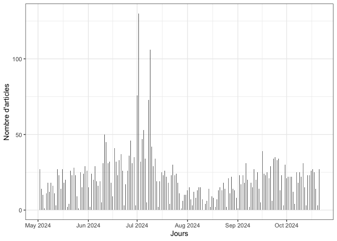
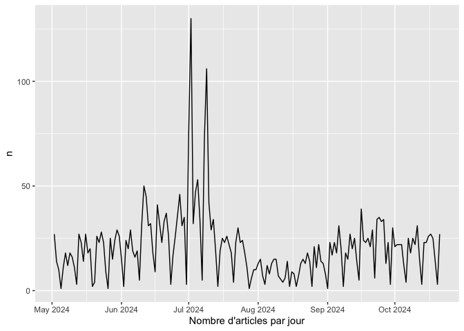
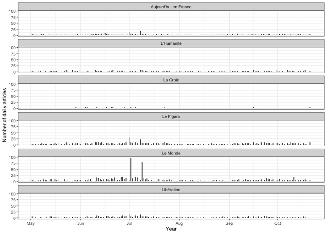
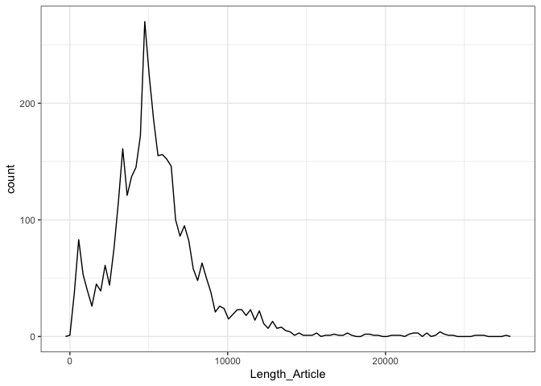
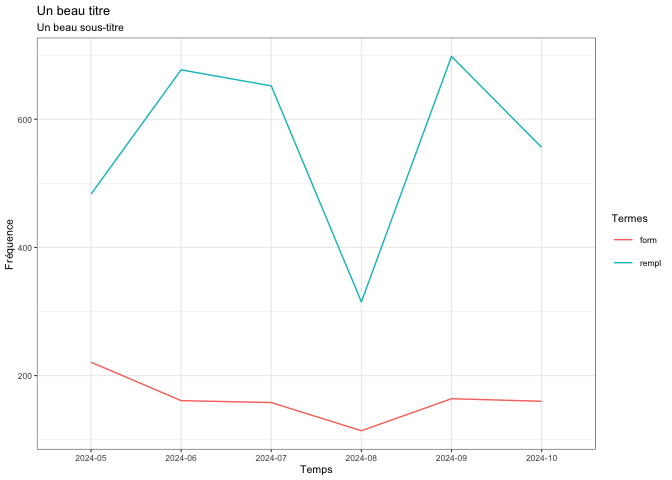

Europresse_to_Dataframe
================
Gilles Bastin
2024-10-21

# Objectif et prérequis

## Objectif

L’objectif est de constituer une base de données d’articles de presse
exploitable avec des outils standards de *text mining* à partir de la
plateforme Europresse (<https://nouveau-europresse-com>). Ce type de
plateformes documentaires est conçu pour permettre de retrouver un
article ou de constituer de petits corpus “à la main”. Afin de
l’utiliser pour constituer un corpus plus important pouvant donner lieu
à une analyse de type text mining ou statistique lexicale il faut passer
par plusieurs étapes de traitement de données qui sont décrites dans ce
tutoriel.

## Prérequis

Ce fichier est un script R au format .Rmd (R Markdown). Vous pouvez le
lire avec n’importe quel éditeur de texte mais si vous l’ouvrez avec
RStudio vous pourrez exécuter le code contenu dans les « chunks »
(morceaux de code) signalés entre `{r}`. Pour cela vous devez cliquer
sur le triangle vert. Si vous débutez en R je vous conseille de lire les
deux tutoriels très bien faits suivants avant de vous lancer dans
celui-ci afin de bien comprendre la logique générale de R : - celui de
Julien Barnier (<https://juba.github.io/tidyverse/index.html>),
notamment les chapitres I et II qui expliquent toute la prise en main du
logiciel. - celui de Joseph Larmarange :
<https://larmarange.github.io/analyse-R/>.

# Accéder à Europresse et rechercher des articles

La plateforme Europresse met à disposition les contenus de centaines de
sources documentaires. Il s’agit principalement de médias (presse,
radio, télé et online) mais aussi d’autres types de sources (rapports,
réseaux sociaux, biographies).

L’accès est en général possible pour les étudiant•es et
enseignants-chercheur•es à partir des licences universitaires. Le plus
simple est donc d’accéder à la plateforme via le répertoire des
ressources numériques sur les sites des bibliothèques universitaires
(qui exigent une identification).

La plateforme permet par défaut une recherche en mode « étudiant » (voir
le menu en haut à droite). Ce mode de consultation des données est
intéressant dans une perspective documentaire (pour s’informer sur un
sujet) mais il ne permet pas une recherche fine ni la sauvegarde des
données dans un format exploitable (les articles ne peuvent être
exportés qu’en PDF, un format pratique pour l’affichage à l’écran et
l’impression mais duquel il est très difficile d’extraire le texte).

Pour paramétrer sa recherche efficacement et ensuite obtenir les
résultats dans un format exploitable (le HTML) il est nécessaire de
changer de mode de consultation :

- Dans le menu en haut à droite passer en « Version classique » à la
  place de « Etudiant »
- Cliquer sur « Recherche simple » dans le menu en haut à gauche
- Cliquer ensuite sur « Recherche avancée » dans ce même menu (admirez
  au passage la logique de l’interface…)

Vous pouvez alors faire une recherche assez fine en définissant :

- Une équation de recherche utilisant les opérateurs & (ET), \| (OU),
  les parenthèses et les guillemets (entre autres). Le choix de cette
  équation de recherche est évidemment crucial. Il est nécessaire a) de
  l’ajuster au mieux à la question de recherche et b) de trouver le bon
  équilibre entre la spécificité des mots-clé utilisés (pour éviter
  d’afficher trop d’articles hors du champ de la recherche) et leur
  généralité (qui permet d’avoir des corpus de grande taille). Il vaut
  en général mieux viser un peu large et réduire ensuite dans la phase
  de traitement des données (par exemple en supprimant les articles qui
  contiennent certains mots clé)
- La liste des sources à explorer (des présélections existent par types
  de source mais il est possible de composer la liste à sa guise).
  Attention : Europresse indexe de très nombreuses sources mais leur
  qualité n’est pas homogène. Certaines sources sont mentionnées comme
  « irrégulières ». Enfin il est nécessaire de distinguer les articles
  d’un média et ceux publiés sur son site en ligne.
- La période à prendre en considération (utiliser une définition fine
  avec une date de départ et une date de fin).

La plateforme indique alors le nombre d’articles trouvés, quelques
statistiques de base et permet d’explorer les articles dans la fenêtre
de gauche.

# Collecter les articles au format HTML

Une fois ces articles affichés on désire les sauvegarder dans un format
qui permettra d’en extraire facilement le texte et les méta-données.
C’est là que les choses deviennent plus compliquées.

En haut à gauche de la liste des articles trouvés figure une boîte à
cocher qui permet de sélectionner tous les articles (on peut aussi les
sélectionner un par un) mais lorsqu’on la coche la platefrome ne
sélectionne que les 50 premiers articles. Il faut scroller jusqu’en bas
de la liste pour que celle-ci se prolonge. Par ailleurs la liste
s’arrête au 1000ème article.

Il faut donc procéder par paquet de 1000 articles et en scrollant
manuellement la fenêtre d’affichage des résultats :

- Afficher les résultats par ordre chronologique croissant et pas par
  pertinence. L’ordre chronologique croissant est le seul qui permet de
  collecter les données de manière méthodique.
- Scroller (20 fois…) jusqu’à atteindre la limite de 1000 articles
- Cocher la boîte en haut à gauche
- Cliquer sur « Sauvegarder » (l’icône de disquette)
- Choisir le format HTML et la sauvegarde dans un fichier, valider
- Dans la boîte de dialogue suivante suivez le lien qui permet de
  télécharger le fichier HTML
- Enregistrer ce fichier dans un dossier sur son disque dur en lui
  donnant un nom simple et un numero (par exemple “moncorpus_1.HTML”)
- Revenir sur Europresse et cliquer sur « recherche avancée » afin de
  retrouver la page de sélection des paramètres de recherche.
- Relancer une recherche en modifiant la date de départ pour la fixer au
  jour du dernier article enregistré dans le fichier précédant (les
  autres paramètres sont inchangés)

L’opération doit être répétée autant de fois que nécessaire.

Remarques :

- le serveur peut être un peu lent : accéder plutôt hors des horaires de
  consultation intensive des étudiant•es et enseignant-chercheur•es;
- attention aux erreurs d’inattention possibles du fait du caractère
  très répétitif des opérations (choix des dates, nommage des fichiers…)
- la méthode génére des doublons sur les dates charnières entre paquets
  de 1000 articles. Ils devront être supprimés ensuite
- vous pouvez évidemment sélectionner les articles qui vous intéressent
  dès la consultation d’Europresse en cochant uniquement ceux-ci. Mais
  le temps de constitution du corpus va alors exploser et vous vous
  exposez à devoir justifier ces choix « à la main ». Il vaut donc mieux
  réfléchir à une équation de recherche assez spécifique pour que vous
  collectiez tous les articles renvoyés par la plateforme, quitte à
  nettoyer ensuite dans la phase d’analyse.

# Convertir les données HTML en dataframe

Pour pouvoir analyser les articles de façon systématique il va falloir
transformer les fichiers HTML de telle sorte que chaque article soit une
ligne dans un tableau de données (« data frame ») dont les colonnes sont
les variables qui caractérisent cet article (source, date, auteur,
texte…).

Charger les bibliothèques (ou paquets) utiles dans l’environnement de
travail (remarque : ces bibliothèques doivent au préalable avoir été
installées dans R, cf. les deux tutoriels cités plus haut pour la
démarche, notamment le 2.5 de Julien Barnier) :

``` r
library(tidyverse) # bibliothèque généraliste (dplyr, ggplot2, tidyr, readr, purr, tibble, stringr, forcats)
```

    ## ── Attaching core tidyverse packages ──────────────────────── tidyverse 2.0.0 ──
    ## ✔ dplyr     1.1.4     ✔ readr     2.1.5
    ## ✔ forcats   1.0.0     ✔ stringr   1.5.1
    ## ✔ ggplot2   3.5.1     ✔ tibble    3.2.1
    ## ✔ lubridate 1.9.3     ✔ tidyr     1.3.1
    ## ✔ purrr     1.0.2     
    ## ── Conflicts ────────────────────────────────────────── tidyverse_conflicts() ──
    ## ✖ dplyr::filter() masks stats::filter()
    ## ✖ dplyr::lag()    masks stats::lag()
    ## ℹ Use the conflicted package (<http://conflicted.r-lib.org/>) to force all conflicts to become errors

``` r
library(XML) # scraping du html
library(stringr) # text mining
library(stringdist) # text mining
```

    ## 
    ## Attaching package: 'stringdist'
    ## 
    ## The following object is masked from 'package:tidyr':
    ## 
    ##     extract

``` r
library(stringi) # text mining
library(lubridate) # gestion des dates
```

Charger une fonction qui permet de lire les HTML qu’on a obtenus sur
Europresse (le script R proposé ici pour le faire est largement tiré de
celui écrit par Corentin Roquebert
<https://quanti.hypotheses.org/1416>). La fonction s’appelle LIRE, mais
vous pouvez bien sûr la renommer à votre guise.

``` r
LIRE <- function(html) {
  doc <- htmlParse(html)  # Parse the document
  articles <- getNodeSet(doc, "//article")  # Get each article

  # Journal extraction with a check for missing data
  journal <- sapply(articles, function(art) {
    journ <- xpathSApply(art, ".//span[@class='DocPublicationName']//text()", xmlValue)
    if (length(journ) == 0) {
      NA  # Return NA if no journal name is found
    } else {
      journ[[1]]
    }
  })

  # Author extraction with a check for missing data
  auteur <- sapply(articles, function(art) {
    aut <- xpathSApply(art, ".//p[@class='sm-margin-bottomNews']/text()", xmlValue)
    if (length(aut) == 0) {
      NA  # Return NA if no author is found
    } else {
      aut[[1]]
    }
  })

  # Title extraction with a check for missing data
  titre <- sapply(articles, function(art) {
    tmp <- xpathSApply(art, ".//p[contains(@class, 'rdp__articletitle')]//text()", xmlValue)
    if (length(tmp) == 0) {
      NA  # Return NA if no title is found
    } else {
      paste(tmp, collapse = "")
    }
  })

  # Date extraction with a check for missing data
  date <- sapply(articles, function(art) {
    tmp <- xpathSApply(art, ".//div[@class='publiC-lblNodoc']//text()", xmlValue)
    if (length(tmp) == 0) {
      NA  # Return NA if no date is found
    } else {
      substr(tmp, 6, 13)
    }
  })
  date <- as.Date(date, "%Y%m%d")  # Format the date

  # Text extraction with a check for missing data
  texte <- sapply(articles, function(art) {
    tmp <- xpathSApply(art, ".//div[@class='DocText clearfix']//text()", xmlValue)
    if (length(tmp) == 0) {
      NA  # Return NA if no text is found
    } else {
      paste(tmp, collapse = "")
    }
  })

  # Compile the data into a data frame
  txt <- data.frame(Journal = journal,
                    Titre = titre,
                    Date = date,
                    Auteur = auteur,
                    Texte = texte,
                    stringsAsFactors = FALSE)

  # Remove rows with missing Journal or Titre values
  txt <- subset(txt, !is.na(Journal) & !is.na(Titre))

  txt
}
```

On a donc maintenant une fonction qui permet d’obtenir les informations
sur les pages HTML structurées comme celles qu’on a téléchargées sur
Europresse. Plutôt que de faire passer manuellement cette fonction sur
toutes les pages HTML, on définit une deuxième fonction qui va être
appliquée sur tous les fichiers HTML d’un dossier de notre ordinateur.
Cette fonction s’appelle lire_dossier :

``` r
lire_dossier <- function(chemin) {

  list<-list.files(chemin, pattern= ".HTML", full.names=TRUE, recursive=TRUE)

  l <- lapply(list, function(file) {
    print(file)
    LIRE(html=file)
  })
  bind_rows(l)
  
}
```

Cette fonction va donc appliquer la fonction LIRE qui transforme les
HTML en base de données sur tous les documents qui ont une extension
.HTML dans un dossier déterminé. Cela tombe bien puisque l’on on a mis
tous nos documents dans un même dossier. On n’a donc qu’à appliquer
cette fonction à ce dossier puis créer un .csv dans ce dossier afin de
sauvegarder le data frame.

``` r
df <- lire_dossier("/Users/basting/Nextcloud/ENSEIGNEMENT/Digital Methods/Digital_Methods_Tutorials/data/Europresse_deputes")
```

    ## [1] "/Users/basting/Nextcloud/ENSEIGNEMENT/Digital Methods/Digital_Methods_Tutorials/data/Europresse_deputes/biblioeuropresse20241021deputes1.HTML"
    ## [1] "/Users/basting/Nextcloud/ENSEIGNEMENT/Digital Methods/Digital_Methods_Tutorials/data/Europresse_deputes/biblioeuropresse20241021deputes2.HTML"
    ## [1] "/Users/basting/Nextcloud/ENSEIGNEMENT/Digital Methods/Digital_Methods_Tutorials/data/Europresse_deputes/biblioeuropresse20241021deputes3.HTML"
    ## [1] "/Users/basting/Nextcloud/ENSEIGNEMENT/Digital Methods/Digital_Methods_Tutorials/data/Europresse_deputes/biblioeuropresse20241021deputes4.HTML"

En cliquant sur df dans l’environnement de travail, on peut visualiser
le dataframe dans son ensemble (mais avec des textes tronqués). On peut
visualiser le texte complet du premier article de la manière suivante :

``` r
df$Texte[1]
```

    ## [1] "\n\n\n    Lucie Castets a failli donner une nouvelle orientation à sa carrière : devenir députée de Grenoble, en remplacement de l’élu de La France insoumise (LFI) Hugo Prevost, accusé de violences sexuelles, et qui avait annoncé sa démission prochaine. La candidate du Nouveau Front populaire (NFP) pour Matignon a finalement renoncé à concourir pour cette législative partielle qui doit se tenir dans la 1re circonscription de l’Isère d’ici au 15 janvier 2025.   Vendredi 18 octobre, elle a annoncé à l’AFP que « les conditions de[sa] candidature n’[étaient] pas été réunies », estimant toutefois que « la personne importe peu et[qu’il] faut tout faire pour que la gauche gagne de nouveau cette circonscription », qui s’étend de Grenoble à une partie de sa banlieue nord. « Ce qui m’a été proposé ne me permettait pas, selon moi, de continuer à agir comme trait d’union de la gauche » , a justifié la haut fonctionnaire de 37 ans.\n\n\nVoilà une grosse semaine que la Parisienne originaire de Normandie hésitait à franchir le cap du suffrage universel. François Hollande, avec qui elle s’entretient régulièrement, lui avait fait comprendre qu’elle n’avait pas vraiment le choix : sans fonction officielle, il serait difficile pour elle de rester l’incarnation du consensus de l’union de la gauche.   Principal frein, le groupe au sein duquel elle aurait dû siéger. La France insoumise avait prévenu : la circonscription lui étant réservée, selon l’accord du NFP, Lucie Castets devrait absolument intégrer le groupe « insoumis » et choisir, en bonus, un suppléant LFI. Mais le mouvement de Jean-Luc Mélenchon, qui ne compte plus que 71 députés (contre 66 pour le Parti socialiste, PS), était tétanisé à l’idée de perdre un siège.  Espoir douchéVendredi 18 octobre, lors d’une réunion publique à Cahors, Jean-Luc Mélenchon, qui ne souhaitait visiblement pas être accusé d’avoir saboté la candidature de la postulante à Matignon, a affirmé que le mouvement était à « sa disposition ». « On comprend qu’elle a été choisie parce qu’elle faisait consensus et qu’elle veut rester dans ce rôle, ça nous va »,a-t-il dit, avant de faire une concession, celle de lui permettre de siéger, comme « apparentée », au même titre qu’Aymeric Caron, député de Paris, qui a son propre parti, Révolution écologique pour le vivant, ou que… l’élu de Seine-Saint-Denis, Jérôme Legavre, du Parti ouvrier indépendant, le parti trotskiste devenu un satellite de LFI. Le fondateur de LFI lui a aussi proposé de se présenter dans les Ardennes, où le député Rassemblement national Flavien Termet vient de démissionner…   Mais Lucie Castets, qui ne souhaitait pas perdre sa spécificité au sein de l’union de la gauche, ne souhaitait pas rejoindre le groupe LFI à l’Assemblée. Elle aurait notamment pu intégrer « le groupe le plus représentatif de la diversité et de l’union de la gauche »,autrement dit, Les Ecologistes, où siègent aussi les ex-frondeurs « insoumis », dont Clémentine Autain et Alexis Corbière (Seine-Saint-Denis), en rupture de ban avec le mouvement de Jean-Luc Mélenchon… Devant ces hésitations, LFI avait prévenu qu’il ne ferait pas campagne à ses côtés. Après avoir songé à aller au rapport de force avec les « insoumis », Lucie Castets a finalement décidé d’en rester là.   Autre obstacle qui devait être levé : le casting des candidats sur la circonscription. Aux dernières législatives, le 7 juillet, Hugo Prevost avait été élu, lors d’une triangulaire, avec seulement 1 300 voix d’avance sur le candidat macroniste, Olivier Véran. Cette fois, l’entourage de Lucie Castets avait compris que l’ancien ministre d’Emmanuel Macron ne se représenterait pas si elle était candidate. Un espoir rapidement douché par le démenti de ce dernier : « Je n’ose imaginer qu’elle puisse corréler un tel parachutage à la peur de rater son atterrissage », a indiqué le macroniste au Monde, tout en préservant le suspense sur sa propre candidature.   Reste à savoir comment va se dérouler l’élection en Isère. Le PS a officiellement investi Amandine Germain, conseillère départementale, mais, selon un communiqué de la fédération locale, le PS était prêt à y renoncer si « Lucie Castets devait finalement être la représentante de toutes les composantes du NFP ».Avec son désistement, il pourrait donc y avoir deux candidats de gauche, alors que c’est LFI qui était censé représenter le NFP. « Après le blocage de la candidature de Lucie Castets par LFI, Amandine Germain peut gagner la circonscription. Soutenue par les Isérois, elle doit l’être par tout le PS », a réitéré vendredi soir sur X l’ancien député socialiste des Bouches-du-Rhône Patrick Mennucci. « Ce serait une rupture unilatérale avec le NFP. J’espère que nos partenaires socialistes seront assez responsables pour ne pas désespérer »les électeurs, avait au préalable mis en garde le député LFI du Val-d’Oise Paul Vannier.  Flou d’Olivier FaureQue va devenir Lucie Castets ? Le 16 octobre, la haut fonctionnaire souhaitait toujours « demeurer au service de l’union de la gauche »,a-t-elle répété à l’AFP. Mais elle n’a aucune garantie qu’elle sera de nouveau candidate à Matignon si Michel Barnier est renversé. Même si plusieurs partenaires du NFP voulaient y croire encore.  « Pour moi, ça n’est pas terminé,estime Elsa Faucillon, députée communiste des Hauts-de-Seine. C’est une des personnes qui souhaitent sincèrement que cette unité vive et se diffuse au local. J’attends, et j’espère d’elle qu’elle continue. Elle doit prendre sa part. Elle fait pas mal de déplacements locaux, ça se raconte. Elle doit en faire un récit politique. »Pour Matthias Tavel, député « insoumis » de la Loire-Atlantique , « elle est toujours[leur] candidate commune. J’attends d’Olivier Faure qu’il explique pourquoi et comment on choisirait quelqu’un d’autre »,ajoute-t-il. Effectivement, le premier secrétaire du PS entretient le flou, écartant un nouveau soutien à Lucie Castets, sans officiellement la lâcher : « Elle ne va pas passer sa vie à jouer à être candidate putative et virtuelle. Elle-même a demandé à être sortie de ce rôle », affirme-t-il. « On peut faire semblant. Ce sera Lucie Castets ou la rupture du NFP », menaçait le coordinateur de LFI, Manuel Bompard.   Jusque-là, le rendez-vous hebdomadaire en visioconférence avec les chefs des quatre partis de gauche était toujours à l’agenda de Lucie Castets. Elle a poursuivi ses déplacements, orchestré les propositions de contre-budget de la gauche, et vu nombre de personnalités de tous bords. Mais la suite de son avenir au sein du NFP doit encore être écrite.\n\n    \n\n\n"

# Nettoyage des données

## Supprimer les doublons d’articles

On commence par supprimer d’éventuels doublons qui peuvent être liés à
la méthode de collecte (voir plus haut) :

``` r
df <- distinct(df)
```

RQ : Corentin Roquebert propose une méthode alternative permettant de
repérer les quasi-doublons (certains articles sont publiés à plusieurs
reprise par un média mais avec de petites variations ou sont des
reprises quasi à l’identique de dépêches AFP…) Utile surtout si on
travaille avec des données du Web (articles mis à jour -\>
quasi-doublons) et de la PQR (dépêches AFP) ET si sa question de
recherche ne prend pas en compte la question de la réception (l’audience
est bien exposée deux fois au contenu !)

Il s’agit maintenant de nettoyer ce corpus, en commençant par les
variables associées à chaque article :

- La date est normalement déjà dans le bon format (sinon, il faut faire
  une petite manipulation avec le paquet lubridate).
- Le journal, en revanche, est assez mal référencé, ou plutôt, pour un
  même journal, il n’est pas toujours écrit de la même manière (pour
  certains comme Le Figaro le numéro du journal est inclus dans le
  titre).
- Le texte contient des balises et autres éléments de mise en forme à
  supprimer

### 4.2. Nettoyage du Titre de la source

On observe que la variable Journal est assez sale :

``` r
## On fait un tri à plat de la variable Journal
df %>% count(Journal) %>% arrange(desc(n))
```

    ##                                                Journal    n
    ## 1               \n        Le Monde                     1140
    ## 2             \n        Libération                      551
    ## 3      \n        Aujourd'hui en France                  490
    ## 4             \n        L'Humanité                      281
    ## 5             \n        l'Humanité                       97
    ## 6   \n        Le Figaro, no. 24837                       31
    ## 7   \n        Le Figaro, no. 24843                       23
    ## 8   \n        Le Figaro, no. 24819                       12
    ## 9   \n        Le Figaro, no. 24823                       12
    ## 10  \n        Le Figaro, no. 24856                       12
    ## 11  \n        Le Figaro, no. 24821                       11
    ## 12  \n        Le Figaro, no. 24838                       11
    ## 13  \n        Le Figaro, no. 24841                       11
    ## 14  \n        Le Figaro, no. 24908                       11
    ## 15  \n        Le Figaro, no. 24932                       11
    ## 16  \n        Le Figaro, no. 24804                       10
    ## 17  \n        Le Figaro, no. 24820                       10
    ## 18  \n        Le Figaro, no. 24836                       10
    ## 19  \n        Le Figaro, no. 24902                       10
    ## 20  \n        Le Figaro, no. 24907                       10
    ## 21  \n        Le Figaro, no. 24922                       10
    ## 22  \n        Le Figaro, no. 24810                        9
    ## 23  \n        Le Figaro, no. 24840                        9
    ## 24  \n        Le Figaro, no. 24845                        9
    ## 25  \n        Le Figaro, no. 24847                        9
    ## 26  \n        Le Figaro, no. 24898                        9
    ## 27  \n        Le Figaro, no. 24904                        9
    ## 28  \n        Le Figaro, no. 24915                        9
    ## 29  \n        Le Figaro, no. 24813                        8
    ## 30  \n        Le Figaro, no. 24825                        8
    ## 31  \n        Le Figaro, no. 24832                        8
    ## 32  \n        Le Figaro, no. 24834                        8
    ## 33  \n        Le Figaro, no. 24839                        8
    ## 34  \n        Le Figaro, no. 24844                        8
    ## 35  \n        Le Figaro, no. 24852                        8
    ## 36  \n        Le Figaro, no. 24855                        8
    ## 37  \n        Le Figaro, no. 24910                        8
    ## 38  \n        Le Figaro, no. 24911                        8
    ## 39  \n        Le Figaro, no. 24918                        8
    ## 40  \n        Le Figaro, no. 24791                        7
    ## 41  \n        Le Figaro, no. 24798                        7
    ## 42  \n        Le Figaro, no. 24800                        7
    ## 43  \n        Le Figaro, no. 24802                        7
    ## 44  \n        Le Figaro, no. 24807                        7
    ## 45  \n        Le Figaro, no. 24815                        7
    ## 46  \n        Le Figaro, no. 24818                        7
    ## 47  \n        Le Figaro, no. 24822                        7
    ## 48  \n        Le Figaro, no. 24835                        7
    ## 49  \n        Le Figaro, no. 24842                        7
    ## 50  \n        Le Figaro, no. 24846                        7
    ## 51  \n        Le Figaro, no. 24848                        7
    ## 52  \n        Le Figaro, no. 24857                        7
    ## 53  \n        Le Figaro, no. 24858                        7
    ## 54  \n        Le Figaro, no. 24880                        7
    ## 55  \n        Le Figaro, no. 24892                        7
    ## 56  \n        Le Figaro, no. 24913                        7
    ## 57  \n        Le Figaro, no. 24923                        7
    ## 58  \n        Le Figaro, no. 24924                        7
    ## 59   \n        La Croix, no. 42946                        6
    ## 60   \n        La Croix, no. 42961                        6
    ## 61   \n        La Croix, no. 43022                        6
    ## 62  \n        Le Figaro, no. 24805                        6
    ## 63  \n        Le Figaro, no. 24809                        6
    ## 64  \n        Le Figaro, no. 24811                        6
    ## 65  \n        Le Figaro, no. 24814                        6
    ## 66  \n        Le Figaro, no. 24826                        6
    ## 67  \n        Le Figaro, no. 24828                        6
    ## 68  \n        Le Figaro, no. 24829                        6
    ## 69  \n        Le Figaro, no. 24850                        6
    ## 70  \n        Le Figaro, no. 24851                        6
    ## 71  \n        Le Figaro, no. 24853                        6
    ## 72  \n        Le Figaro, no. 24893                        6
    ## 73  \n        Le Figaro, no. 24894                        6
    ## 74  \n        Le Figaro, no. 24896                        6
    ## 75  \n        Le Figaro, no. 24899                        6
    ## 76  \n        Le Figaro, no. 24900                        6
    ## 77  \n        Le Figaro, no. 24906                        6
    ## 78  \n        Le Figaro, no. 24909                        6
    ## 79  \n        Le Figaro, no. 24914                        6
    ## 80  \n        Le Figaro, no. 24917                        6
    ## 81  \n        Le Figaro, no. 24920                        6
    ## 82  \n        Le Figaro, no. 24925                        6
    ## 83  \n        Le Figaro, no. 24926                        6
    ## 84  \n        Le Figaro, no. 24929                        6
    ## 85   \n        La Croix, no. 42930                        5
    ## 86   \n        La Croix, no. 42935                        5
    ## 87   \n        La Croix, no. 42956                        5
    ## 88   \n        La Croix, no. 42962                        5
    ## 89  \n        Le Figaro, no. 24786                        5
    ## 90  \n        Le Figaro, no. 24792                        5
    ## 91  \n        Le Figaro, no. 24793                        5
    ## 92  \n        Le Figaro, no. 24795                        5
    ## 93  \n        Le Figaro, no. 24799                        5
    ## 94  \n        Le Figaro, no. 24806                        5
    ## 95  \n        Le Figaro, no. 24816                        5
    ## 96  \n        Le Figaro, no. 24827                        5
    ## 97  \n        Le Figaro, no. 24830                        5
    ## 98  \n        Le Figaro, no. 24854                        5
    ## 99  \n        Le Figaro, no. 24879                        5
    ## 100 \n        Le Figaro, no. 24882                        5
    ## 101 \n        Le Figaro, no. 24897                        5
    ## 102 \n        Le Figaro, no. 24903                        5
    ## 103 \n        Le Figaro, no. 24905                        5
    ## 104 \n        Le Figaro, no. 24921                        5
    ## 105 \n        Le Figaro, no. 24928                        5
    ## 106  \n        La Croix, no. 42934                        4
    ## 107  \n        La Croix, no. 42936                        4
    ## 108  \n        La Croix, no. 42941                        4
    ## 109  \n        La Croix, no. 42949                        4
    ## 110  \n        La Croix, no. 42950                        4
    ## 111  \n        La Croix, no. 42959                        4
    ## 112  \n        La Croix, no. 42977                        4
    ## 113  \n        La Croix, no. 43052                        4
    ## 114 \n        Le Figaro, no. 24796                        4
    ## 115 \n        Le Figaro, no. 24797                        4
    ## 116 \n        Le Figaro, no. 24859                        4
    ## 117 \n        Le Figaro, no. 24863                        4
    ## 118 \n        Le Figaro, no. 24864                        4
    ## 119 \n        Le Figaro, no. 24865                        4
    ## 120 \n        Le Figaro, no. 24872                        4
    ## 121 \n        Le Figaro, no. 24883                        4
    ## 122 \n        Le Figaro, no. 24884                        4
    ## 123 \n        Le Figaro, no. 24886                        4
    ## 124 \n        Le Figaro, no. 24888                        4
    ## 125 \n        Le Figaro, no. 24890                        4
    ## 126 \n        Le Figaro, no. 24895                        4
    ## 127 \n        Le Figaro, no. 24901                        4
    ## 128 \n        Le Figaro, no. 24927                        4
    ## 129 \n        Le Figaro, no. 24931                        4
    ## 130  \n        La Croix, no. 42914                        3
    ## 131  \n        La Croix, no. 42920                        3
    ## 132  \n        La Croix, no. 42923                        3
    ## 133  \n        La Croix, no. 42925                        3
    ## 134  \n        La Croix, no. 42928                        3
    ## 135  \n        La Croix, no. 42931                        3
    ## 136  \n        La Croix, no. 42932                        3
    ## 137  \n        La Croix, no. 42947                        3
    ## 138  \n        La Croix, no. 42958                        3
    ## 139  \n        La Croix, no. 42964                        3
    ## 140  \n        La Croix, no. 42966                        3
    ## 141  \n        La Croix, no. 42970                        3
    ## 142  \n        La Croix, no. 42972                        3
    ## 143  \n        La Croix, no. 42992                        3
    ## 144  \n        La Croix, no. 43006                        3
    ## 145  \n        La Croix, no. 43007                        3
    ## 146  \n        La Croix, no. 43014                        3
    ## 147  \n        La Croix, no. 43023                        3
    ## 148  \n        La Croix, no. 43028                        3
    ## 149  \n        La Croix, no. 43030                        3
    ## 150  \n        La Croix, no. 43040                        3
    ## 151  \n        La Croix, no. 43050                        3
    ## 152 \n        Le Figaro, no. 24789                        3
    ## 153 \n        Le Figaro, no. 24790                        3
    ## 154 \n        Le Figaro, no. 24794                        3
    ## 155 \n        Le Figaro, no. 24803                        3
    ## 156 \n        Le Figaro, no. 24812                        3
    ## 157 \n        Le Figaro, no. 24824                        3
    ## 158 \n        Le Figaro, no. 24833                        3
    ## 159 \n        Le Figaro, no. 24849                        3
    ## 160 \n        Le Figaro, no. 24868                        3
    ## 161 \n        Le Figaro, no. 24870                        3
    ## 162 \n        Le Figaro, no. 24875                        3
    ## 163 \n        Le Figaro, no. 24876                        3
    ## 164 \n        Le Figaro, no. 24881                        3
    ## 165 \n        Le Figaro, no. 24885                        3
    ## 166 \n        Le Figaro, no. 24887                        3
    ## 167 \n        Le Figaro, no. 24891                        3
    ## 168  \n        La Croix, no. 42921                        2
    ## 169  \n        La Croix, no. 42942                        2
    ## 170  \n        La Croix, no. 42943                        2
    ## 171  \n        La Croix, no. 42954                        2
    ## 172  \n        La Croix, no. 42955                        2
    ## 173  \n        La Croix, no. 42971                        2
    ## 174  \n        La Croix, no. 42973                        2
    ## 175  \n        La Croix, no. 42980                        2
    ## 176  \n        La Croix, no. 42982                        2
    ## 177  \n        La Croix, no. 42983                        2
    ## 178  \n        La Croix, no. 42990                        2
    ## 179  \n        La Croix, no. 42995                        2
    ## 180  \n        La Croix, no. 42999                        2
    ## 181  \n        La Croix, no. 43016                        2
    ## 182  \n        La Croix, no. 43025                        2
    ## 183  \n        La Croix, no. 43029                        2
    ## 184  \n        La Croix, no. 43031                        2
    ## 185  \n        La Croix, no. 43034                        2
    ## 186  \n        La Croix, no. 43036                        2
    ## 187 \n        Le Figaro, no. 24787                        2
    ## 188 \n        Le Figaro, no. 24788                        2
    ## 189 \n        Le Figaro, no. 24801                        2
    ## 190 \n        Le Figaro, no. 24817                        2
    ## 191 \n        Le Figaro, no. 24860                        2
    ## 192 \n        Le Figaro, no. 24861                        2
    ## 193 \n        Le Figaro, no. 24869                        2
    ## 194 \n        Le Figaro, no. 24871                        2
    ## 195 \n        Le Figaro, no. 24874                        2
    ## 196 \n        Le Figaro, no. 24878                        2
    ## 197 \n        Le Figaro, no. 24916                        2
    ## 198 \n        Le Figaro, no. 24919                        2
    ## 199 \n        Le Figaro, no. 24930                        2
    ## 200    \n        La Croix, no. 232                        1
    ## 201  \n        La Croix, no. 42915                        1
    ## 202  \n        La Croix, no. 42917                        1
    ## 203  \n        La Croix, no. 42918                        1
    ## 204  \n        La Croix, no. 42924                        1
    ## 205  \n        La Croix, no. 42926                        1
    ## 206  \n        La Croix, no. 42929                        1
    ## 207  \n        La Croix, no. 42944                        1
    ## 208  \n        La Croix, no. 42948                        1
    ## 209  \n        La Croix, no. 42953                        1
    ## 210  \n        La Croix, no. 42960                        1
    ## 211  \n        La Croix, no. 42965                        1
    ## 212  \n        La Croix, no. 42968                        1
    ## 213  \n        La Croix, no. 42976                        1
    ## 214  \n        La Croix, no. 42978                        1
    ## 215  \n        La Croix, no. 42979                        1
    ## 216  \n        La Croix, no. 42984                        1
    ## 217  \n        La Croix, no. 42985                        1
    ## 218  \n        La Croix, no. 42988                        1
    ## 219  \n        La Croix, no. 42989                        1
    ## 220  \n        La Croix, no. 42998                        1
    ## 221  \n        La Croix, no. 43000                        1
    ## 222  \n        La Croix, no. 43001                        1
    ## 223  \n        La Croix, no. 43002                        1
    ## 224  \n        La Croix, no. 43005                        1
    ## 225  \n        La Croix, no. 43011                        1
    ## 226  \n        La Croix, no. 43012                        1
    ## 227  \n        La Croix, no. 43013                        1
    ## 228  \n        La Croix, no. 43018                        1
    ## 229  \n        La Croix, no. 43019                        1
    ## 230  \n        La Croix, no. 43020                        1
    ## 231  \n        La Croix, no. 43032                        1
    ## 232  \n        La Croix, no. 43035                        1
    ## 233  \n        La Croix, no. 43038                        1
    ## 234  \n        La Croix, no. 43041                        1
    ## 235  \n        La Croix, no. 43043                        1
    ## 236  \n        La Croix, no. 43047                        1
    ## 237  \n        La Croix, no. 43048                        1
    ## 238 \n        Le Figaro, no. 24808                        1
    ## 239 \n        Le Figaro, no. 24831                        1
    ## 240 \n        Le Figaro, no. 24866                        1
    ## 241 \n        Le Figaro, no. 24873                        1
    ## 242 \n        Le Figaro, no. 24877                        1
    ## 243 \n        Le Figaro, no. 24889                        1
    ## 244 \n        Le Figaro, no. 24912                        1

On recode :

``` r
df$Journal_clean <- NULL
df$Journal_clean[stri_detect_fixed(df$Journal, "figaro", case_insensitive=T)] <- "Le Figaro"
df$Journal_clean[stri_detect_fixed(df$Journal, "libération", case_insensitive=T)] <- "Libération"
df$Journal_clean[stri_detect_fixed(df$Journal, "monde", case_insensitive=T)] <- "Le Monde"
df$Journal_clean[stri_detect_fixed(df$Journal, "humanité", case_insensitive=T)] <- "L'Humanité"
df$Journal_clean[stri_detect_fixed(df$Journal, "croix", case_insensitive=T)] <- "La Croix"
df$Journal_clean[stri_detect_fixed(df$Journal, "aujourd'hui", case_insensitive=T)] <- "Aujourd'hui en France"
df$Journal_clean[stri_detect_fixed(df$Journal, "ouest", case_insensitive=T)] <- "Sud Ouest"
df %>% count(Journal_clean) %>% arrange(desc(n))
```

    ##           Journal_clean    n
    ## 1              Le Monde 1140
    ## 2             Le Figaro  857
    ## 3            Libération  551
    ## 4 Aujourd'hui en France  490
    ## 5            L'Humanité  378
    ## 6              La Croix  212

### 4.3. Nettoyage de la variable Texte

Cette étape permet de nettoyer un peu le texte des articles qui est
parfois assez sale. Elle n’est pas obligatoire. Le mieux est de faire
une première lecture sur le data frame et de juger si elle est
nécessaire.

#### 4.3.1. On enlève tout ce qui est entre balise (des balises html peuvent être resté dans le texte)

``` r
df$Texte<- gsub ("", "", df$Texte)
df$Titre<- gsub ("", "", df$Titre)
```

#### 4.3.2. On enlève les adresses mails (souvent situés en début ou en fin d’article)

``` r
df$Texte<- gsub (" [^ ]*@.[^ ]* ", " ", df$Texte)
df$Titre<- gsub (" [^ ]*@.[^ ]* ", " ", df$Titre)
```

#### 4.3.3. On supprime les mention “mis à jour le …” qui figurent souvent dans le texte

``` r
df$Texte<- gsub(".is à jour le .{20}[^ ]* ", "", df$Texte) # On enlève dès qu'il est question de "mis à jour le" et les 20 caractères qui suivent jusqu'au prochain espace.
df$Texte<- gsub("propos recueillis par .{20}[^ ]* ", "", df$Texte) # On enlève dès qu'il est question de "propos recueillis par" et les 20 caractères qui suivent jusqu'au prochain espace.
```

#### 4.3.4. Autres nettoyages possibles

Le cas échéant, on enlève les étoiles, qui peuvent poser problème à
Iramuteq (plus que les autres caractères spéciaux)

``` r
df$Texte<-gsub("\\*", "", df$Texte)
```

### 4.4. Création d’un identifiant pour chaque article

``` r
## On crée une variable identifiant unique pour chaque article (sera utile pour l'exploitation du data frame)
df <- df %>%
  arrange(Date) %>%
  mutate(ID_Article = row_number())
```

## Longueur des articles (optionnel)

``` r
## On crée une variable longueur de l'article
df <- df %>%
  mutate(Length_Article = nchar(Texte))
```

``` r
df %>% group_by(Journal_clean) %>% summarise(longmoy = mean(Length_Article))
```

    ## # A tibble: 6 × 2
    ##   Journal_clean         longmoy
    ##   <chr>                   <dbl>
    ## 1 Aujourd'hui en France   4302.
    ## 2 L'Humanité              4658.
    ## 3 La Croix                3820.
    ## 4 Le Figaro               5887.
    ## 5 Le Monde                6310.
    ## 6 Libération              6209.

## Variables de date (optionnel)

Par défaut la date est au format YYYY-MM-DD. On peut avoir besoin de
dates un peu plus agrégées pour représenter l’évolution du corpus par
année, par mois…

On commence par une variable Annee :

``` r
## On crée une variable Année
df <- df %>%
  mutate(Annee = year(Date))
```

Puis on crée une variable Mois :

``` r
## On crée une variable Mois
df <- df %>% mutate(Mois = str_sub(Date, 6, 7))
```

On crée une variable Annee-Mois

``` r
## On crée une variable Année-Mois
df <- df %>%
  mutate(YM = paste(Annee, Mois, sep = "-"))
```

## Suppression d’articles marginaux

On peut vouloir supprimer systématiquement certains articles. Voici le
code utile dans les cas les plus fréquents :

``` r
# Supprimer les articles contenant "pomme" ou "poire" :
df <- df %>% filter(!str_detect(Texte,"pomme|poire") == TRUE)
# Supprimer les articles commençant par "Pomme" ou "Poire"
df <- df %>% filter(!str_detect(Texte,"^Pomme|^Poire") == TRUE)
# Supprimer les articles de plus de 30.000 caractères :
df <- df %>% filter(nchar(Texte) < 30000)
# Supprimer les articles antérieurs au 1er janvier 1990 :
df <- df %>% filter(Date >= "1990-01-01")
```

# Exploration élémentaire du corpus

On vérifie la distribution du corpus dans le temps :

``` r
df %>% count(year(Date))
```

    ##   year(Date)    n
    ## 1       2024 3599

``` r
df %>% count(Date) %>% arrange(desc(n))
```

    ##           Date   n
    ## 1   2024-07-02 130
    ## 2   2024-07-09 106
    ## 3   2024-07-01  76
    ## 4   2024-07-08  73
    ## 5   2024-07-05  53
    ## 6   2024-06-11  50
    ## 7   2024-07-04  47
    ## 8   2024-06-27  46
    ## 9   2024-06-12  45
    ## 10  2024-07-10  42
    ## 11  2024-06-17  41
    ## 12  2024-09-16  39
    ## 13  2024-06-21  37
    ## 14  2024-06-26  36
    ## 15  2024-06-29  35
    ## 16  2024-09-24  35
    ## 17  2024-07-06  34
    ## 18  2024-07-12  34
    ## 19  2024-09-23  34
    ## 20  2024-09-26  34
    ## 21  2024-06-20  33
    ## 22  2024-09-25  33
    ## 23  2024-06-14  32
    ## 24  2024-06-18  32
    ## 25  2024-07-03  32
    ## 26  2024-06-10  31
    ## 27  2024-06-13  31
    ## 28  2024-06-28  31
    ## 29  2024-09-06  31
    ## 30  2024-10-11  31
    ## 31  2024-07-23  30
    ## 32  2024-09-30  30
    ## 33  2024-05-30  29
    ## 34  2024-06-05  29
    ## 35  2024-07-11  29
    ## 36  2024-09-21  29
    ## 37  2024-05-23  28
    ## 38  2024-05-02  27
    ## 39  2024-05-13  27
    ## 40  2024-05-16  27
    ## 41  2024-09-11  27
    ## 42  2024-10-17  27
    ## 43  2024-10-21  27
    ## 44  2024-05-21  26
    ## 45  2024-05-31  26
    ## 46  2024-06-22  26
    ## 47  2024-06-25  26
    ## 48  2024-07-18  26
    ## 49  2024-10-16  26
    ## 50  2024-05-27  25
    ## 51  2024-07-16  25
    ## 52  2024-09-13  25
    ## 53  2024-09-19  25
    ## 54  2024-10-07  25
    ## 55  2024-10-09  25
    ## 56  2024-10-18  25
    ## 57  2024-05-29  24
    ## 58  2024-06-03  24
    ## 59  2024-07-25  24
    ## 60  2024-09-17  24
    ## 61  2024-05-14  23
    ## 62  2024-05-22  23
    ## 63  2024-05-24  23
    ## 64  2024-06-19  23
    ## 65  2024-07-17  23
    ## 66  2024-07-22  23
    ## 67  2024-07-24  23
    ## 68  2024-09-02  23
    ## 69  2024-09-04  23
    ## 70  2024-09-18  23
    ## 71  2024-09-28  23
    ## 72  2024-10-14  23
    ## 73  2024-10-15  23
    ## 74  2024-07-19  22
    ## 75  2024-08-28  22
    ## 76  2024-10-02  22
    ## 77  2024-10-03  22
    ## 78  2024-10-04  22
    ## 79  2024-10-10  22
    ## 80  2024-08-26  21
    ## 81  2024-09-20  21
    ## 82  2024-10-01  21
    ## 83  2024-05-18  20
    ## 84  2024-06-04  20
    ## 85  2024-09-07  20
    ## 86  2024-09-12  20
    ## 87  2024-06-06  19
    ## 88  2024-06-08  19
    ## 89  2024-07-13  19
    ## 90  2024-07-15  19
    ## 91  2024-05-07  18
    ## 92  2024-05-09  18
    ## 93  2024-05-17  18
    ## 94  2024-06-15  18
    ## 95  2024-07-20  18
    ## 96  2024-07-26  18
    ## 97  2024-08-23  18
    ## 98  2024-09-05  18
    ## 99  2024-09-09  18
    ## 100 2024-10-08  18
    ## 101 2024-06-24  17
    ## 102 2024-09-03  17
    ## 103 2024-05-10  16
    ## 104 2024-06-07  16
    ## 105 2024-05-28  15
    ## 106 2024-06-01  15
    ## 107 2024-08-02  15
    ## 108 2024-08-08  15
    ## 109 2024-08-09  15
    ## 110 2024-08-21  15
    ## 111 2024-09-10  15
    ## 112 2024-10-12  15
    ## 113 2024-05-03  14
    ## 114 2024-05-15  14
    ## 115 2024-08-14  14
    ## 116 2024-08-24  14
    ## 117 2024-08-29  14
    ## 118 2024-09-14  14
    ## 119 2024-10-19  14
    ## 120 2024-08-01  13
    ## 121 2024-08-07  13
    ## 122 2024-08-20  13
    ## 123 2024-08-22  13
    ## 124 2024-08-30  13
    ## 125 2024-09-27  13
    ## 126 2024-05-08  12
    ## 127 2024-08-05  12
    ## 128 2024-10-05  12
    ## 129 2024-05-06  11
    ## 130 2024-05-11  11
    ## 131 2024-07-27  11
    ## 132 2024-08-27  11
    ## 133 2024-05-04  10
    ## 134 2024-07-30  10
    ## 135 2024-07-31  10
    ## 136 2024-05-25   9
    ## 137 2024-06-16   9
    ## 138 2024-08-16   9
    ## 139 2024-08-06   8
    ## 140 2024-08-17   8
    ## 141 2024-08-31   8
    ## 142 2024-08-03   7
    ## 143 2024-08-10   7
    ## 144 2024-08-19   7
    ## 145 2024-07-29   6
    ## 146 2024-08-13   6
    ## 147 2024-09-22   6
    ## 148 2024-06-09   5
    ## 149 2024-07-07   5
    ## 150 2024-09-15   5
    ## 151 2024-05-20   4
    ## 152 2024-07-21   4
    ## 153 2024-08-12   4
    ## 154 2024-10-06   4
    ## 155 2024-05-12   3
    ## 156 2024-06-23   3
    ## 157 2024-06-30   3
    ## 158 2024-08-04   3
    ## 159 2024-09-29   3
    ## 160 2024-10-13   3
    ## 161 2024-10-20   3
    ## 162 2024-05-19   2
    ## 163 2024-06-02   2
    ## 164 2024-07-14   2
    ## 165 2024-08-15   2
    ## 166 2024-08-18   2
    ## 167 2024-08-25   2
    ## 168 2024-09-08   2
    ## 169 2024-05-05   1
    ## 170 2024-05-26   1
    ## 171 2024-07-28   1
    ## 172 2024-09-01   1

On la représente :

``` r
df %>%
#  filter(Date >= "1990-01-01") %>%
  ggplot(aes(Date)) +  
      geom_histogram(binwidth = 0.25) +   
      scale_x_date(date_breaks = "1 month", date_labels =  "%b %Y") +  
      xlab("Jours") +
      ylab("Nombre d'articles") +
  theme_bw()
```

<!-- -->

On fait la même chose mais par source :

``` r
articles.jour <- df %>% group_by(Date) %>% summarise(n=n())
plot <- ggplot(articles.jour, aes(x=Date, y=n)) +
      geom_line() + 
      scale_x_date(date_breaks = "1 month", date_labels =  "%b %Y") +
      xlab("Nombre d'articles par jour")
plot
```

<!-- -->

``` r
## Une autre dans laquelle on fait un histogram "à facettes" pour chaque journal
df %>%
  filter(!is.na(Journal_clean)) %>%
  ggplot(aes(x = Date)) +
  geom_histogram(binwidth=0.5) +
 # scale_x_date(labels = date_format("%b")) +
  ylab("Number of daily articles") +
  xlab("Year") +
  theme_bw(base_size = 8) +
  facet_wrap(Journal_clean ~ ., ncol=1)
```

<!-- -->

On vérifie la distribution de la variable de longueur des articles :

``` r
df %>% ggplot(aes(x = Length_Article)) + geom_freqpoly(bins = 100) + theme_bw()
```

<!-- -->

# 6. Conclusion

À ce stade, vous disposez maintenant d’une base de données (un df ou
dataframe en langage R) propre et facilement utilisable pour faire du
text mining sur les contenus des articles ou tout autre type de
traitement statistique (voir le tuto text mining). La collecte des
données sur Europresse est un peu laborieuse du fait de la nécessité de
scroller les listes de résultats mais cela n’est pas non plus
rédhibitoire. Avec un peu d’entraînement on peut en effet collecter les
fichiers HTML de 1000 articles en moins de 5 mn, ce qui fait 12.000 à
l’heure… En revanche attention aux erreurs de manipulation possible à
plusieurs étapes.

Cherchons des occurrences de mots caractéristiques de ces paniques.

``` r
sum(str_count(df$Texte, "victoire"))
```

    ## [1] 932

``` r
sum(str_count(df$Texte, "défaite"))
```

    ## [1] 403

On va créer des variables qui comptent ces occurrences par ligne pour
pouvoir ensuite mesurer des moyennes selon les modalités de différentes
variables.

``` r
df %>%
  mutate(victoire = str_count(df$Texte, "victoire"),
         defaite = str_count(df$Texte, "défaite")) %>%
  summarise(vic = mean(victoire),
            def = mean(defaite))
```

    ##         vic       def
    ## 1 0.2589608 0.1119755

``` r
df %>%
  mutate(victoire = str_count(df$Texte, "victoire"),
         defaite = str_count(df$Texte, "défaite")) %>%
  group_by(Journal_clean) %>%
  summarise(vic = mean(victoire),
            def = mean(defaite))
```

    ## # A tibble: 6 × 3
    ##   Journal_clean           vic    def
    ##   <chr>                 <dbl>  <dbl>
    ## 1 Aujourd'hui en France 0.183 0.0926
    ## 2 L'Humanité            0.239 0.0928
    ## 3 La Croix              0.166 0.0284
    ## 4 Le Figaro             0.296 0.146 
    ## 5 Le Monde              0.272 0.111 
    ## 6 Libération            0.292 0.125

On peut faire mieux en passant en fréquence de mots pour éviter que la
longueur des articles biaise le résultat. On calcule en occurrences pour
1000 mots.

``` r
df %>%
  mutate(victoire = str_count(df$Texte, "victoire")/Length_Article*1000,
         defaite = str_count(df$Texte, "défaite")/Length_Article*1000) %>%
  group_by(Journal_clean) %>%
  summarise(vic = mean(victoire),
            def = mean(defaite))
```

    ## # A tibble: 6 × 3
    ##   Journal_clean            vic     def
    ##   <chr>                  <dbl>   <dbl>
    ## 1 Aujourd'hui en France 0.0425 0.0209 
    ## 2 L'Humanité            0.0530 0.0218 
    ## 3 La Croix              0.0440 0.00638
    ## 4 Le Figaro             0.0556 0.0268 
    ## 5 Le Monde              0.0453 0.0184 
    ## 6 Libération            0.0529 0.0234

La limite de cette approche est évidente : a) on ne cherche qu’un mot ;
b) on doit connaître ce mot.

On peut repousser un peu cette limite en cherchant des champs lexicaux
définis par des listes de mots. Une remarque : ChatGPT est un expert de
la langue : ne pas hésiter à lui demander de produire ce genre de
listes.

``` r
mots_remplacement <- "licenciement|licencié|chomâge|chômeur|licenciements|licenciée|chômeuse|chômeurs|emploi|travail"
mots_formation <- "examen|examens|triche|fraude|université|universités|plagiat"
```

On calcule les occurrences :

``` r
df %>%
  mutate(remplacement = str_count(Texte, mots_remplacement),
         formation = str_count(Texte, mots_formation)) %>%
  summarise(rempl = sum(remplacement),
            form = sum(formation))
```

    ##   rempl form
    ## 1  3381  978

Et les fréquences :

``` r
df %>%
  mutate(remplacement = str_count(Texte, mots_remplacement)/Length_Article*1000,
         formation = str_count(Texte, mots_formation)/Length_Article*1000) %>%
  summarise(rempl = mean(remplacement, na.rm = T),
            form = mean(formation, na.rm = T))
```

    ##     rempl       form
    ## 1 0.16663 0.05116366

On peut ventiler en fonction du journal :

``` r
df %>%
  mutate(remplacement = str_count(Texte, mots_remplacement),
         formation = str_count(Texte, mots_formation)) %>%
  group_by(Journal) %>%
  summarise(rempl = sum(remplacement),
            form = sum(formation))
```

    ## # A tibble: 243 × 3
    ##    Journal                                             rempl  form
    ##    <chr>                                               <int> <int>
    ##  1 "\n        Aujourd'hui en France                "     330    86
    ##  2 "\n        L'Humanité                    "            368    53
    ##  3 "\n        La Croix, no. 232                    "       0     0
    ##  4 "\n        La Croix, no. 42914                    "     0     0
    ##  5 "\n        La Croix, no. 42915                    "     2     0
    ##  6 "\n        La Croix, no. 42917                    "     0     0
    ##  7 "\n        La Croix, no. 42918                    "     0     0
    ##  8 "\n        La Croix, no. 42920                    "     2     1
    ##  9 "\n        La Croix, no. 42921                    "     1     3
    ## 10 "\n        La Croix, no. 42923                    "     1     0
    ## # ℹ 233 more rows

La même chose mais par année-mois avec une courbe :

``` r
df %>%
  mutate(remplacement = str_count(Texte, mots_remplacement),
         formation = str_count(Texte, mots_formation)) %>%
  group_by(YM) %>%
  summarise(rempl = sum(remplacement),
            form = sum(formation)) %>%
  gather(Termes, Value, -c(YM)) %>%
  ggplot(aes(x = YM, y = Value, fill = Termes, group=Termes, color=Termes)) +
  geom_line() +
  labs(x = "Temps",
       y = "Fréquence",
       title = "Un beau titre",
       subtitle = "Un beau sous-titre") +
  theme_bw(base_size = 8)
```

<!-- -->

On peut d’ores-et-déjà faire une sauvegarde en .csv de ce dataframe :

``` r
write.csv2(df, file="nom_fichier(avec_chemin_acces)", row.names = FALSE)
```

À partir de maintenant on pourra repartir directement du fichier de
données avec la fonction suivante :

``` r
# df <- read_csv2("nom_fichier(avec_chemin_acces)")
```
